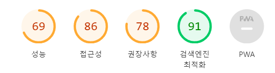

프로젝트를 완료한 이후, 사용자 경험을 향상시키기 위해 성능 최적화에 집중했습니다. 이 과정에서 다양한 성능 측정 도구 중 가장 쉽게 측정할 수 있고 무료로 사용할 수 있는 `Google`의 `Lighthouse`가 큰 도움이 되었습니다. 이번 글에서는 `Lighthouse`를 활용한 성능 측정 및 최적화 경험에 대해 소개하고자 합니다.

{: .prompt-info }

> 이 글은 **2024-04-20** 에 업데이트 되었습니다.

{: .prompt-warning }

> 이 글은 **HTML, CSS , JavaScript, TypeScript, React**에 대한 기본적인 지식을 알고 있어야 합니다.

## Lighthouse 란?


`Lighthouse`는 `Google`이 개발한 웹 애플리케이션의 품질을 향상시키는 데 사용되는 오픈 소스, 자동화된 도구입니다. 개발자들이 웹 앱의 성능을 평가하고 향상시킬 수 있는 방법을 제공합니다.

### 주요 기능

`Lighthouse`는 아래와 같은 5가지 주요 기능에 대한 점수를 제공합니다.

- 성능 측정: Lighthouse는 페이지 로딩 속도, 상호작용 가능성, 시각적 안정성과 같은 성능 지표를 측정합니다. 이를 통해 사용자 경험이 얼마나 빠르고 매끄러운지 평가할 수 있습니다.

- 접근성 평가: 웹 애플리케이션이 다양한 사용자, 특히 장애를 가진 사용자들에게 얼마나 접근 가능한지를 분석합니다. 이는 색 대비, 키보드 접근성, 스크린 리더 지원 등을 포함합니다.

- 모범 사례: 크로스 브라우저 호환성, HTTPS 사용, 이미지 최적화 등 웹 개발의 모범 사례를 점검하여 웹 애플리케이션의 전반적인 코드 품질을 향상시킵니다.

- SEO 평가: 페이지가 검색 엔진 최적화(SEO)에 적합한지 확인합니다. 이는 메타 태그 사용, 접근 가능한 컨텐츠, 적절한 링크 구조 등을 포함하여 검색 엔진에서 웹사이트의 가시성을 높입니다.

- 프로그레시브 웹 앱(PWA) 체크: 웹 애플리케이션이 PWA의 기준을 충족하는지 검사하여 오프라인에서도 작동 가능하고, 빠르게 로드되며, 플랫폼에 통합될 수 있는지 확인합니다.

### 사용 방법

`Lighthouse`는 크롬 개발자 도구 내에 내장되어 있으며, 크롬 브라우저에서 직접 실행할 수 있습니다. 또한, 명령줄 도구(Node CLI), 웹 UI(Lighthouse Viewer)를 통해서도 실행할 수 있으며, 지속적 통합(CI) 환경에서도 사용 가능합니다.

`Lighthouse`를 실행하면, 선택한 카테고리에 따라 웹사이트를 분석하고, 각 항목에 대한 점수와 함께 개선할 수 있는 구체적인 권장 사항을 제공합니다. 이를 통해 웹 개발자는 자신의 애플리케이션을 최적화하여 더 나은 사용자 경험을 제공할 수 있습니다.

## 개선 전 프로젝트 점수



기존 프로젝트를 `Lighthouse` 점수 측정 결과 성능과 접근성 권장사항 모두 낮은 점수가 나왔습니다. 따라서 `Lighthouse`의 권장사항을 토대로 각각의 항목 점수를 하나씩 개선 하였습니다.

### 성능(Performance) 개선


`Lighthouse` 의 성능의 세부사항을 보면 위의 이미지와 같이 `First Contentful Paint`와 `Speed Index`, `Total Blocking Time`는 점수가 권장 사항 이내로 나왔지만
`Cumulative Layout Shift`와 `Largest Contentful Paint` 는 점수가 좋지 못했습니다.

{: .prompt-info }

> **각 세부사항에 대한 설명은 다음과 같습니다.**
>
> - **First Contentful Paint (FCP)**: 사용자가 페이지를 요청한 후 브라우저에 첫 번째 콘텐츠가 표시되기까지 걸리는 시간입니다. 이는 페이지가 얼마나 빠르게 로드되는지를 나타냅니다.
> - **Largest Contentful Paint (LCP)**: 페이지의 가장 큰 콘텐츠 요소(일반적으로 이미지 또는 텍스트)가 브라우저에 표시되는 시간입니다. 이는 사용자가 페이지를 인식하는 데 필요한 시간을 나타냅니다.
> - **Speed Index**: 페이지의 시각적 로딩 속도를 측정하는 지표입니다. 이는 페이지의 콘텐츠가 얼마나 빨리 화면에 표시되는지를 나타냅니다. Speed Index가 낮을수록 페이지가 더 빠르게 시각적으로 로드되는 것을 의미합니다.
> - **Total Blocking Time (TBT)**: 페이지가 블록되어 사용자의 입력에 반응하지 않는 시간의 총합입니다. 이는 페이지가 얼마나 부드럽게 로드되는지를 나타내는 지표로 사용됩니다.
> - **Cumulative Layout Shift (CLS)**: 페이지의 요소가 로드되는 동안 레이아웃이 얼마나 안정적으로 유지되는지를 나타냅니다. 이는 사용자가 페이지를 스크롤하거나 클릭할 때 예상치 못한 레이아웃 변경이 발생하는 정도를 측정합니다.

### Largest Contentful Paint 점수 높이기

#### 이미지 형식 변경


첫 번째 문제점으로는 위의 이미지에서 볼 수 있듯이 `banner` 컴포넌트에서 사용하는 이미지가 너무 커서 `PNG`나 `JPEG`대신 `Webp`나 `AVIF`로 압축하여 제공하라는 내용이었습니다. 따라서 `banner`의 이미지를 Webp로 변환시켜주었습니다.

#### 대규모 레이아웃 변경 방지


두 번쨰 문제는 대규모 레이아웃의 변경을 피하라는 내용이었습니다. 홈 페이지에서 제공하는 라이브 테이블의 크기가 로딩중 일때는 작게 보이고 로딩이 끝나면 이미지가 채워지면서 레이아웃이 변경되는 것이 문제 같았습니다.

따라서 이것을 해결하기 위해 스켈레톤 UI를 만들어 적용해 주었습니다.

```tsx
//...

const {
  data: nextMatch,
  isLoading,
  isError,
  isSuccess,
  error,
} = useNextMatchQuery();

<div
  className={clsx(
    `relative h-[285px] w-full rounded-md p-2 shadow-md sm:min-w-[500px]`,
    theme === "light" ? "bg-White " : "bg-DarkGrey "
  )}
>
  {isLoading ? <HomeSkeleton /> : null}
  {isError ? <div>에러 메세지</div> : null}
  {isSuccess && !nextMatch ? (
    <div className="flex h-full w-full items-center justify-center p-2 text-xl font-bold">
      다음 경기가 없습니다.
    </div>
  ) : null}
  {isSuccess && nextMatch ? <>다음 경기가 있습니다.</> : null}
</div>;
```

위의 코드는 `isLoading`일 때 스켈레톤 UI를 보여주고 에러와 성공했을 때를 조건부로 보여지게 만들었습니다.

### Cumulative Layout Shift 점수 높이기

### 접근성 개선

## 전 후 비교
